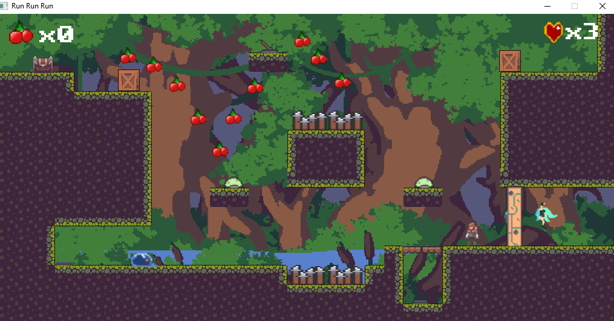

# ****RUN_RUN_RUN****

## ***Giới thiệu về bản thân***

  - Họ và tên: Lâm Hoàng Hải
    
  - Mã Sinh Viên: 22028057

  - Lớp học phần: 2324H_INT2215_70

## ***Giới thiệu về game***

  *Đây là một game giải đố kết hợp hành động dạng giống Fire Boy và Water Girl kết hợp một chút hành động giống Mario.*
  
  *Công chúa của bạn đã bị gã phù thủy xấu xa bắt cóc, bạn phải đến khu rừng nguyên sinh The Origin để trải qua các thử thách và cứu công chúa.*

Video giới thiệu về game: 

## ***Cách thức chơi game***
  *Bạn phải tránh những cái bẫy nguy hiểm chết người, đồng thời tìm cách giải đố để qua được màn kế tiếp.* 
  
  *Khi bạn đã giải được đố cho một màn, cánh cửa mở đến màn tiếp theo sẽ được mở ra.*

## **Hình ảnh về loại quái**

|   Quái  | Máu | 
|---------|----------|
|  | 1 | 
|  | 1 | 
|  | 1 | 

## **Cách điều khiển**

| Chức năng   |  Phím ấn |
|-------------|----------|
|  Sang Trái  |     A    |
|  Sang Phải  |     D    |
|  Tấn công   |     E    |
|  Dịch chuyển|     F    |
|  Nhảy       |     SPACE|
|  Tạm dừng   |     Esc  |

## **Một số vật phẩm trong game**

|   Vật phẩm  | Mô tả | 
|---------|----------|
|     |     Hòm chứa quả cherry    | 
|         |     Quả cherry tăng điểm    | 
|      |     Cần gạt để mở thanh chắn    | 
|      |     Thanh chắn cản người chơi   | 
|      |     Hộp để giải mã   | 
|      |     Nút ấn để mở cửa  | 
|      |     Cửa khóa  | 
|      |     Nàng công chúa bạn phải giải cứu | 
|      |     Bẫy gai | 
|      |     Nấm giúp người chơi nhảy cao hơn | 

## **Một vài hình ảnh về Game**
- *Menu*

- *Instruction*

- *Map đầu tiên*

- *Map thứ hai*

- *Map thứ ba*

- *Map thứ bốn*

- *Map thứ năm*

- *Pause*

- *Thua cuộc*

- *Chiến thắng*

## **Cấu trúc của game**

- Game.cpp: Chuyển trạng thái của game (MENU, ĐANG CHƠI, HƯỚNG DẪN, THOÁT)

- GameWindow.cpp: Thực hiện các bước khởi tạo ban đầu cũng như liên tục cập nhật tình trạng của game
  
- GameObject.cpp:
  
        Lớp quản lý việc tạo ảnh cho các đối tượng trong game
- Animation.cpp:

        Lớp quản lý những hoạt ảnh chuyển động cho các đối tượng trong game

- Collision.cpp:

          Lớp quản lý việc xử lý va chạm cho các đối tượng trong game

- GameMap.cpp:

          Lớp thực hiện việc tải đồ họa lên cho game, cũng như xử lý tương tác giữa các đồ họa

- Player.cpp:

        Lớp kế thừa GameObject, xử lý logic cho người chơi

- Monster.cpp:

        Lớp kế thừa GameObject, xử lý logic cho quái vật
- Surface.cpp:

        Lớp kế thừa GameObject, xử lý logic cho phần map đứng trên      
- Princess.cpp:

        Lớp kế thừa GameObject, xử lý logic cho công chúa cần giải cứu    
- Cherry.cpp:

        Lớp kế thừa GameObject, xử lý logic cho vật phẩm quả cherry
- Box.cpp:

        Lớp kế thừa GameObject, xử lý logic cho chiếc hộp để mở cửa       
- ClosedDoor.cpp:

        Lớp kế thừa GameObject, xử lý logic cho cánh cửa khóa
- Plate.cpp:

        Lớp kế thừa GameObject, xử lý logic cho nút mở cửa khóa     
- Spikes.cpp:

        Lớp kế thừa GameObject, xử lý logic cho bẫy gai
- Jump.cpp:

        Lớp kế thừa GameObject, xử lý logic cho vật phẩm hỗ trợ nhảy   
- Treasure.cpp:

        Lớp kế thừa GameObject, xử lý logic cho kho báu
- Instruction.cpp:
  
        Lớp quản lý việc tạo chữ cũng như xử lý cho hướng dẫn
- Menu.cpp:
  
        Lớp quản lý việc tạo chữ cũng như xử lý cho menu
                      
## **Cách cài đặt**

- Bước 1: Download file về máy

- Bước 2: Giải nén

- Bước 3: Tìm file Run_Run_Run.exe, mở file ra và tận hưởng trò chơi.

## **Kỹ thuật sử dụng**

 - Sử dụng được một sổ tính năng trong SDL2.0 : xử lí ảnh, va chạm, chuyển động, hiển thị chữ, âm thanh, thời gian, thao tác chuột, bàn phím,...

 - Sử dụng nhiều class, vector, mảng, biến, tách file, nạp chồng toán tử,...

 - Tạo ra các đối tượng nhân vật, quái vật, các bút bấm,..

 - Sử dụng photoshop để chỉnh sửa một vài ảnh theo mong muốn.

 - Tự tạo ra menu, nút bằng cách hiển thị khung và chữ chèn lên.

 - Dùng các kiến thức toán học, vật lí để tinh toán về thời gian hồi chiêu, vận tốc, hướng di chuyển của quái đi theo nhân vật,...

 - Tách các file, dùng Máy trạng thái,...

## **Nguồn tham khảo**

- Tham khảo chủ yếu trên lazyfoo về các cách sử dụng các hàm trong SDL2.0

- Học trên youtube: Let's Make Game, Mike Shah,... về cách dùng máy trạng thái và cách vẽ và sử dụng map.

- Lấy source ảnh và âm thanh, font chữ ở trên itch.io và 

## **Kết luận**

### **Điều hạn chế**

- Code chưa được sạch sẽ, gọn gàng.

- Khi chia file còn chưa tối ưu, chưa chia thành từng folder.

- Thiếu thời gian để hoàn thiện game nhiều hơn, mới chỉ thể hiện được một phần game mong muốn.

- Do tự xây dựng nên chưa thể quản lí tốt dẫn đến một vài bug nên khi muốn update một cái gì mới vào thì sẽ xuất hiện một só lỗi chính vì thế gây khó khăn khi update một tính năng hay ho nào đó(Có lẽ là điều hạn chế lớn nhất đối với em).

### **Hướng phát triển game**

- Cập nhật tính năng nhân vật đa dạng hơn để người chơi lựa chọn.

- Nhiều loại quái thú hơn.

- Tạo ra nhiều màn với số lượng quái thú nhất định để người chơi vượt qua.

- Có thể tạo ra chế độ Co-op để có thể chơi cùng bạn bè.

- Thêm tên của người chơi và bảng xếp hạng

- Tạo ra nhiều chiêu thức đa dạng phong phú.

- Tăng thêm độ khó cho game bằng cách mỗi khi người chơi tăng cấp thì quái cũng sẽ thay đổi.
  

