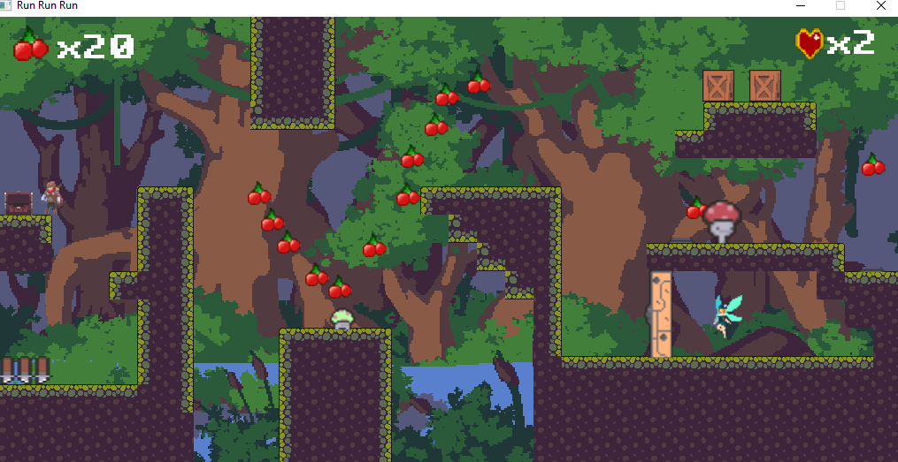
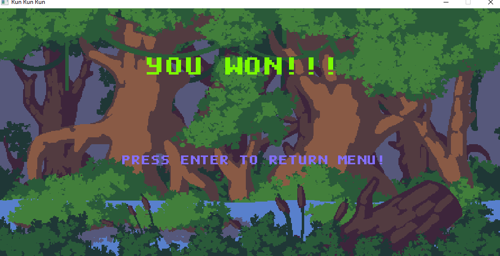

# ****RUN_RUN_RUN****

## ***Giới thiệu về bản thân***

  - Họ và tên: Lâm Hoàng Hải
    
  - Mã Sinh Viên: 22028057

  - Lớp học phần: 2324H_INT2215_70

## ***Giới thiệu về game***

  *Đây là một game giải đố kết hợp hành động dạng giống Fire Boy và Water Girl kết hợp một chút hành động giống Mario.*
  
  *Công chúa của bạn đã bị gã phù thủy xấu xa bắt cóc, bạn phải đến khu rừng nguyên sinh The Origin để trải qua các thử thách và cứu công chúa.*

Video giới thiệu về game: https://www.youtube.com/watch?v=VWDgkFck9i4

## ***Cách thức chơi game***
  *Bạn phải tránh những cái bẫy nguy hiểm chết người, đồng thời tìm cách giải đố để qua được màn kế tiếp.* 
  
  *Khi bạn đã giải được đố cho một màn, cánh cửa mở đến màn tiếp theo sẽ được mở ra.*

## **Hình ảnh về loại quái**

|   Quái  | Máu | 
|---------|----------|
|  | 1 | 
|  | 1 | 
|  | 1 | 

## **Cách điều khiển**

| Chức năng   |  Phím ấn |
|-------------|----------|
|  Sang Trái  |     A    |
|  Sang Phải  |     D    |
|  Tấn công   |     E    |
|  Dịch chuyển|     F    |
|  Nhảy       |     SPACE|
|  Tạm dừng   |     Esc  |

## **Một số vật phẩm trong game**

|   Vật phẩm  | Mô tả | 
|---------|----------|
|     |     Hòm chứa quả cherry    | 
|         |     Quả cherry tăng điểm    | 
|      |     Cần gạt để mở thanh chắn    | 
|      |     Thanh chắn cản người chơi   | 
|      |     Hộp để giải mã   | 
|      |     Nút ấn để mở cửa  | 
|      |     Cửa khóa  | 
|      |     Nàng công chúa bạn phải giải cứu | 
|      |     Bẫy gai | 
|      |     Nấm giúp người chơi nhảy cao hơn | 

## **Một vài hình ảnh về Game**
- *Menu*

- *Instruction*

- *Map đầu tiên*

- *Map thứ hai*

- *Map thứ ba*

- *Map thứ bốn*

- *Map thứ năm*

- *Pause*

- *Thua cuộc*

- *Chiến thắng*

## **Cấu trúc của game**

- Game.cpp: Chuyển trạng thái của game (MENU, ĐANG CHƠI, HƯỚNG DẪN, THOÁT)

- GameWindow.cpp: Thực hiện các bước khởi tạo ban đầu cũng như liên tục cập nhật tình trạng của game
  
- GameObject.cpp:
  
        Lớp quản lý việc tạo ảnh cho các đối tượng trong game
- Animation.cpp:

        Lớp quản lý những hoạt ảnh chuyển động cho các đối tượng trong game

- Collision.cpp:

          Lớp quản lý việc xử lý va chạm cho các đối tượng trong game

- GameMap.cpp:

          Lớp thực hiện việc tải đồ họa lên cho game, cũng như xử lý tương tác giữa các đồ họa

- Player.cpp:

        Lớp kế thừa GameObject, xử lý logic cho người chơi

- Monster.cpp:

        Lớp kế thừa GameObject, xử lý logic cho quái vật
- Surface.cpp:

        Lớp kế thừa GameObject, xử lý logic cho phần map đứng trên      
- Princess.cpp:

        Lớp kế thừa GameObject, xử lý logic cho công chúa cần giải cứu    
- Cherry.cpp:

        Lớp kế thừa GameObject, xử lý logic cho vật phẩm quả cherry
- Box.cpp:

        Lớp kế thừa GameObject, xử lý logic cho chiếc hộp để mở cửa       
- ClosedDoor.cpp:

        Lớp kế thừa GameObject, xử lý logic cho cánh cửa khóa
- Plate.cpp:

        Lớp kế thừa GameObject, xử lý logic cho nút mở cửa khóa     
- Spikes.cpp:

        Lớp kế thừa GameObject, xử lý logic cho bẫy gai
- Jump.cpp:

        Lớp kế thừa GameObject, xử lý logic cho vật phẩm hỗ trợ nhảy   
- Treasure.cpp:

        Lớp kế thừa GameObject, xử lý logic cho kho báu
- Instruction.cpp:
  
        Lớp quản lý việc tạo chữ cũng như xử lý cho hướng dẫn
- Menu.cpp:
  
        Lớp quản lý việc tạo chữ cũng như xử lý cho menu
                      
## **Cách cài đặt**

## a. Cách 1: Không bao gồm code.

- Tải game (được nén thành .zip) tại link sau: https://github.com/Alblue123/Run-Run-Run/releases/tag/v.2.2
- Giải nén game vào một thư mục và bật Run_Run_Run.exe lên và chơi.

## b. Cách 2: Bao gồm code và có thể biên dịch.

- Clone project từ trên github
- Làm theo hướng dẫn của lazyfoo để cài đặt SDL2: https://lazyfoo.net/tutorials/SDL/06_extension_libraries_and_loading_other_image_formats/index.php
- Tải về một trình biên dịch như CodeBlock và chạy

## **Kỹ thuật sử dụng**

 - Sử dụng được một sổ tính năng trong SDL2.0 : xử lí ảnh, va chạm, chuyển động, hiển thị chữ, âm thanh, thời gian, thao tác chuột, bàn phím,...

 - Sử dụng nhiều class, vector, mảng, biến, tách file, kế thừa, ...

 - Tạo ra các đối tượng nhân vật, quái vật, các bút bấm,..

 - Tạo ra các đối tượng đồ họa xử lý va chạm của nhau.

 - Sử dụng phần mềm aesprite để xử lý đồ họa.

 - Tự tạo ra menu, nút bằng cách hiển thị khung và chữ chèn lên.

 - Dùng các kiến thức toán học, vật lí để tinh toán về thời gian hồi chiêu, vận tốc, hướng di chuyển của quái đi theo nhân vật,...

## **Nguồn tham khảo**

- Sử dụng các bài giảng có sẵn tại Lazyfoo:  https://lazyfoo.net/tutorials/SDL/index.php
- Tham khảo các nguồn có sẵn trên youtube như như [Let's make Game](https://www.youtube.com/@CarlBirch "Let's make Game"), [Maydayscode](https://www.youtube.com/@Madsycode "Maydayscode") và nhiều github repo khác
- Sử dụng đồ họa miễn phí tại itch.io và âm thanh tại mixkit: https://mixkit.co/free-sound-effects/

## **Kết luận**

### **Điều hạn chế**
- Do hạn chế về mặt thời gian nên xử lý đồ họa vẫn chưa được mượt mà, nhiều lúc dẫn đến nhân vật bị mất mạng tại khoảng cận biên của bẫy hay quái

- Khi vượt quá phạm vi màn hình, nhân vật sẽ bị lỗi.

- Nhiều phần code chưa thực hiện được quy tắc SOLID. 

- Các hàm nên được phân chia nữa ra để cho thực hiện đơn nhất tính năng và tránh dài.

### **Hướng phát triển game**
- Tiếp tục cải thiện xử lý đồ họa cho mượt mà hơn. 

- Thêm một con boss ở màn thứ 6 coi như kết thúc game, đánh bại quái vật và giải cứu công chúa.

- Thêm máu cho quái, đa dạng chủng loại hơn, cũng như thêm đồ rớt ra.

- Thêm thống kê lại thời gian, vật phẩm khi thắng hay thua game.

- Thêm hardmode tăng phần thử thách.

